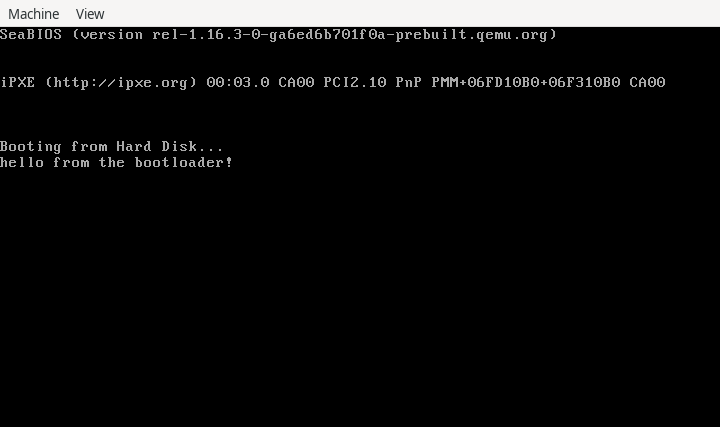

Minimalistic bootloader for x86-64.

```shell
gmake
qemu-system-x86_64 -drive file=boot.bin,format=raw
```

To write bootsector to the USB stick.
```shell
dmesg | grep da
gpart show daX
dd if=boot.bin of=/dev/daX
```


